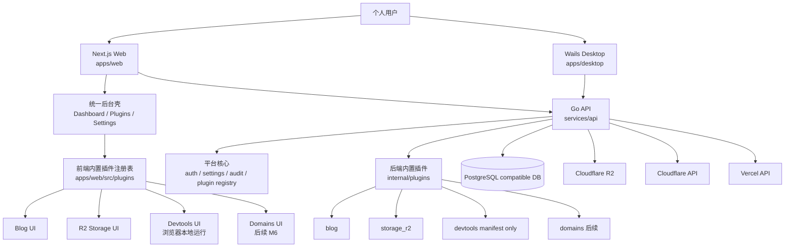
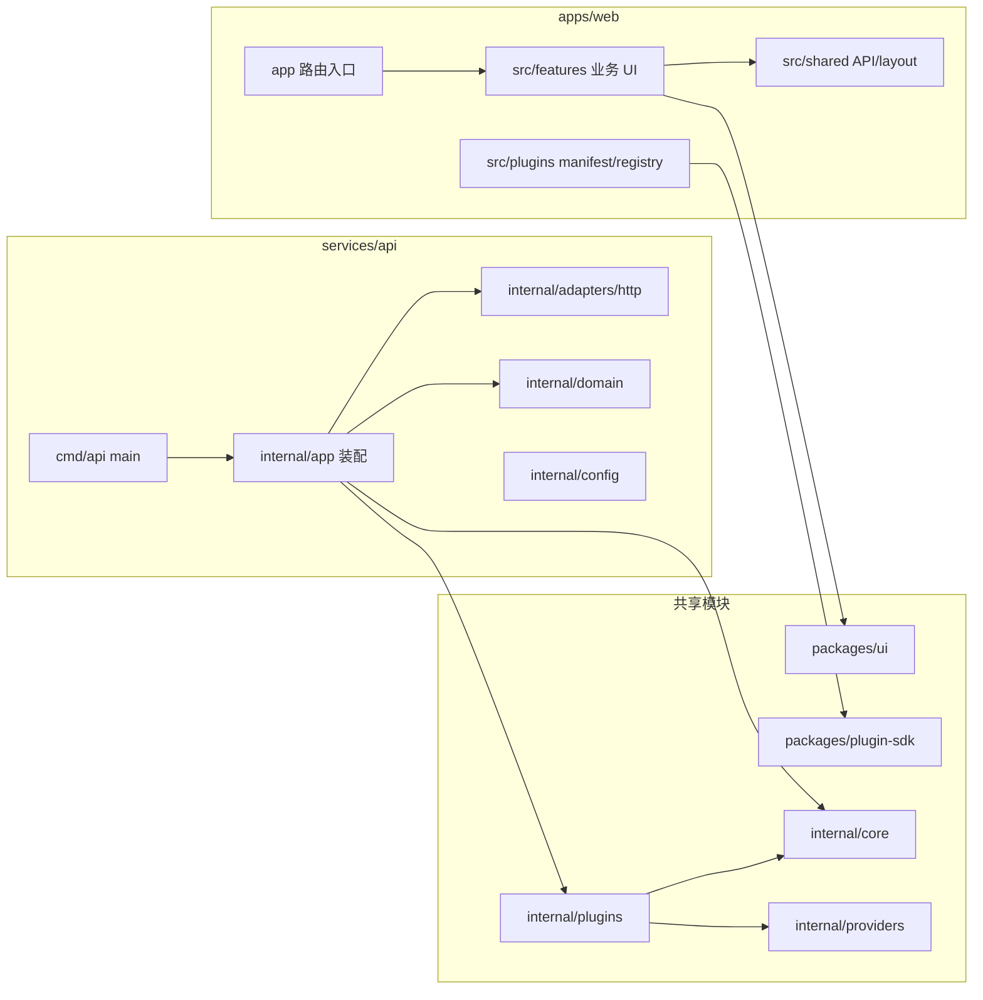
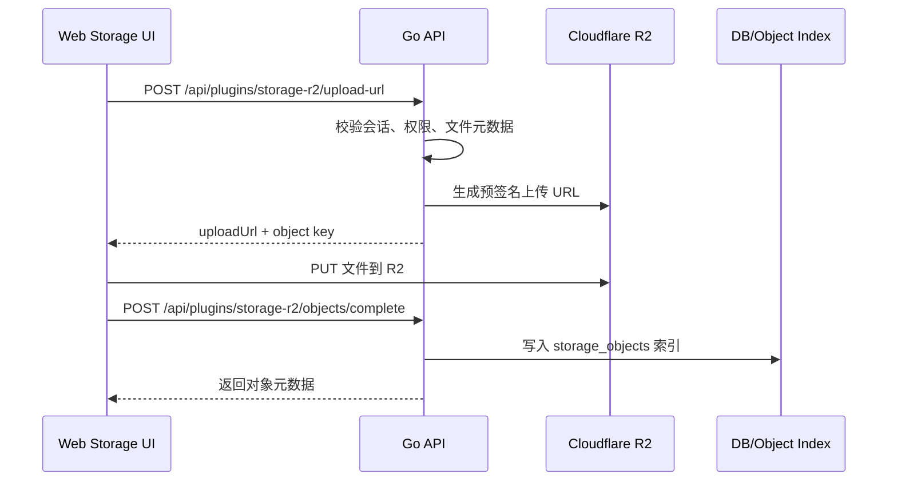
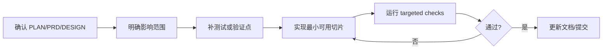

# WeOpen

WeOpen 是一个面向个人开发者的低成本、插件化个人管理平台。它把博客、R2 文件管理、开发工具箱、域名资产、设置和审计能力收敛到一个统一后台，并预留 Web、API、Desktop 多端复用路径。

> 当前分支已完成平台骨架、认证/设置、插件框架、博客、R2 存储和 Devtools 插件；Domains、Desktop 深化和部署硬化仍在后续里程碑中推进。详细计划见 [`PLAN.md`](PLAN.md)。

## 目录

- [核心目标](#核心目标)
- [技术栈](#技术栈)
- [架构图](#架构图)
- [仓库结构](#仓库结构)
- [内置插件](#内置插件)
- [本地开发流程](#本地开发流程)
- [常用命令](#常用命令)
- [环境变量](#环境变量)
- [开发约定](#开发约定)
- [相关文档](#相关文档)

## 核心目标

- **低成本部署**：Web 优先部署到 Vercel，文件对象使用 Cloudflare R2，数据库使用 PostgreSQL 兼容托管服务。
- **插件化扩展**：v1 使用编译期内置插件，不做远程动态加载或插件市场。
- **单用户/邀请制优先**：聚焦个人自用场景，避免过早引入多租户和复杂权限。
- **敏感输入本地优先**：开发工具箱等敏感输入尽量在浏览器或桌面本地运行，不默认上传到 API。
- **多端复用**：Next.js Web、Go API、Wails Desktop、共享 UI/SDK 保持清晰边界。

## 技术栈

| 层级 | 技术 | 说明 |
| --- | --- | --- |
| Web | Next.js App Router + React + TypeScript | 管理后台、插件页面、Dashboard、设置中心 |
| API | Go + `net/http` | 认证、设置、审计、插件 API、外部 provider 适配 |
| Desktop | Wails v3 + React | 桌面预览壳、本地工具、远程 API 模式 |
| Package 管理 | pnpm workspace | 管理 `apps/*` 与 `packages/*` |
| Go 多模块 | `go.work` | 管理 API、Desktop、内部插件和 provider 模块 |
| UI | `@weopen/ui` | Web/Desktop 共享 React UI primitives |
| 插件 SDK | `@weopen/plugin-sdk` | 前端插件 manifest、registry、导航和 widget 类型 |
| 对象存储 | Cloudflare R2 | 博客素材、附件、普通文件、备份对象 |
| 数据库 | PostgreSQL 兼容数据库 | 业务数据、插件状态、审计记录、对象索引 |

## 架构图

### 系统总览



### 代码分层



### R2 直传流程



## 仓库结构

```text
.
├─ apps/
│  ├─ web/                 # Next.js Web 后台
│  └─ desktop/             # Wails v3 桌面端
├─ services/
│  └─ api/                 # Go API 服务
├─ packages/
│  ├─ ui/                  # 共享 React UI primitives
│  ├─ plugin-sdk/          # 前端插件 SDK
│  ├─ sdk/                 # OpenAPI 生成 SDK 的预留位置
│  └─ config/              # 共享 TS/ESLint 配置
├─ internal/
│  ├─ core/                # 平台核心 Go contracts
│  ├─ providers/           # R2、Cloudflare 等外部 provider
│  └─ plugins/             # 后端内置插件
├─ db/
│  ├─ migrations/          # 数据库迁移
│  └─ seed/                # 种子数据预留
├─ docs/                   # PRD、设计、开发规范、计划文档
├─ PLAN.md                 # 里程碑实施计划
├─ pnpm-workspace.yaml
└─ go.work
```

## 内置插件

| 插件 | 路由 | 当前状态 | 运行边界 |
| --- | --- | --- | --- |
| Blog | `/blog` | 已实现文章列表、编辑、预览、发布状态和 R2 封面关联 | Web + API |
| R2 Storage | `/storage` | 已实现对象列表、上传 URL、完成索引、下载/删除/可见性管理 | Web + API + R2 |
| Devtools | `/tools` | 已实现 JSON、Base64、URL、时间戳、UUID、JWT decode、Hash/HMAC、Regex；Cron parser 暂缓 | 浏览器本地优先 |
| Domains | `/domains` | 计划在 M6 实现 Cloudflare/manual read-only 域名管理 | Web + API + Cloudflare |

## 本地开发流程

### 1. 准备环境

建议版本：

- Node.js 24.x 或当前项目兼容的 LTS/Current 版本
- pnpm 10.x（仓库声明：`pnpm@10.18.2`）
- Go 1.25.x（当前 `go.mod` / `go.work` 使用 `go 1.25.2`）
- Wails v3 CLI（仅桌面端开发需要）
- PostgreSQL 兼容数据库（当前本地 API 可用内存实现启动，完整持久化流程按后续迁移配置）

### 2. 安装依赖

```powershell
pnpm install
```

### 3. 配置环境变量

复制示例文件：

```powershell
Copy-Item .env.example .env
```

本地开发默认 `APP_ENV=local` 时，API 会为部分必填项提供本地默认值。需要连接真实 R2、Cloudflare 或托管数据库时，再补齐 `.env` 中对应变量。

### 4. 启动 API

```powershell
pnpm dev:api
```

默认地址：

```text
http://localhost:8080
```

健康检查：

```powershell
Invoke-RestMethod http://localhost:8080/healthz
```

预期返回：

```json
{
  "status": "ok",
  "service": "weopen-api"
}
```

### 5. 启动 Web

另开一个终端：

```powershell
pnpm dev:web
```

默认地址：

```text
http://localhost:3000
```

常用页面：

- `http://localhost:3000/dashboard`
- `http://localhost:3000/blog`
- `http://localhost:3000/storage`
- `http://localhost:3000/tools`
- `http://localhost:3000/plugins`
- `http://localhost:3000/settings`

### 6. 启动 Desktop（可选）

确保已安装 Wails v3 CLI 后运行：

```powershell
pnpm dev:desktop
```

也可以只检查桌面前端类型：

```powershell
pnpm --dir apps/desktop/frontend typecheck
```

### 7. 开发一个功能的推荐顺序



推荐命令顺序：

```powershell
git status --short
pnpm --filter @weopen/web test
pnpm --filter @weopen/web typecheck
pnpm --filter @weopen/web lint
pnpm --filter @weopen/web build
go test ./services/api/...
```

Go workspace 根目录不是单一 Go module，因此不要把 `go test ./...` 当成根目录全量验证命令。需要覆盖内部模块时显式列出模块路径，例如：

```powershell
go test ./services/api/... ./internal/core/... ./internal/plugins/blog/... ./internal/plugins/devtools/... ./internal/plugins/storage_r2/... ./internal/providers/r2/...
```

## 常用命令

| 命令 | 用途 |
| --- | --- |
| `pnpm install` | 安装 workspace 依赖 |
| `pnpm dev:web` | 启动 Next.js Web |
| `pnpm dev:api` | 启动 Go API |
| `pnpm dev:desktop` | 启动 Wails Desktop |
| `pnpm lint` | 运行所有已声明 lint 脚本 |
| `pnpm typecheck` | 运行所有已声明 TypeScript typecheck |
| `pnpm test` | 运行所有已声明前端/包测试 |
| `pnpm build` | 运行所有已声明构建 |
| `pnpm --filter @weopen/web build` | 构建 Web 应用 |
| `go test ./services/api/...` | 测试 API module |

## 环境变量

完整模板见 [`.env.example`](.env.example)。核心变量如下：

| 变量 | 用途 | 本地默认/说明 |
| --- | --- | --- |
| `APP_ENV` | API 运行环境 | `local` |
| `APP_URL` | API 对外地址 | `http://localhost:8080` |
| `WEB_ORIGIN` | CORS 允许的 Web origin | `http://localhost:3000` |
| `NEXT_PUBLIC_API_BASE_URL` | Web 访问 API 的地址 | `http://localhost:8080` |
| `DATABASE_URL` | PostgreSQL 兼容数据库连接 | 完整持久化时配置 |
| `SESSION_SECRET` | Session 签名/派生密钥 | 生产必须替换 |
| `SECRET_ENCRYPTION_KEY` | 外部服务密钥加密 key | 生产必须替换 |
| `ADMIN_EMAIL` | 本地单用户账号 | `admin@example.com` |
| `ADMIN_PASSWORD` | 本地单用户密码 | local 未配置时 API 使用 `admin` |
| `R2_ACCOUNT_ID` / `R2_BUCKET` | R2 账号和 bucket | 真实上传需配置 |
| `R2_ACCESS_KEY_ID` / `R2_SECRET_ACCESS_KEY` | R2 凭证 | 不得使用 `NEXT_PUBLIC_*` 暴露 |
| `CLOUDFLARE_API_TOKEN` | Cloudflare 域名/DNS 读取 token | M6 使用 |
| `VERCEL_API_TOKEN` | Vercel 集成 token | 后续部署/域名能力使用 |

## 开发约定

- v1 插件是**编译期内置插件**，不要引入远程动态代码加载。
- 不新增依赖，除非任务明确需要并记录原因。
- Secret 不得进入前端 bundle；不要把密钥放入 `NEXT_PUBLIC_*`。
- 高风险操作（删除对象、删除文章、替换 secret、未来 DNS 写操作）必须有确认和审计路径。
- 提交信息遵循仓库 Lore Commit Protocol：第一行写“为什么”，正文写约束、取舍和验证证据。
- 每个可回归行为都应有测试或可重复验证命令。

## 相关文档

- [产品需求文档](docs/PRD-personal-management-platform.md)
- [技术设计文档](docs/DESIGN-personal-management-platform.md)
- [实施计划](PLAN.md)
- [开发规范](docs/development/DEVELOPMENT_STANDARDS.md)
- [分层架构重构设计](docs/plans/2026-05-14-layered-architecture-restructure-design.md)
